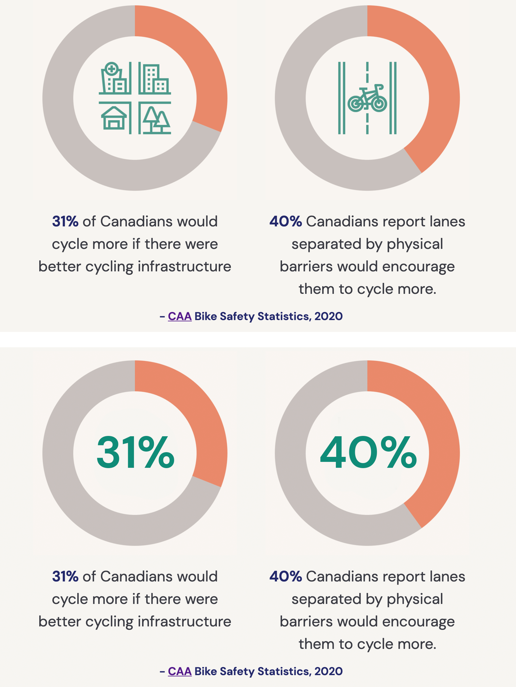
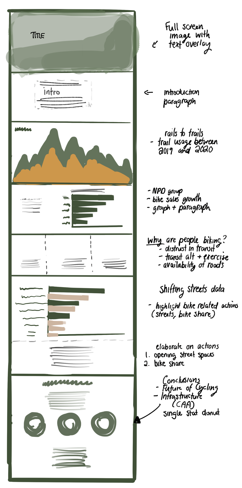
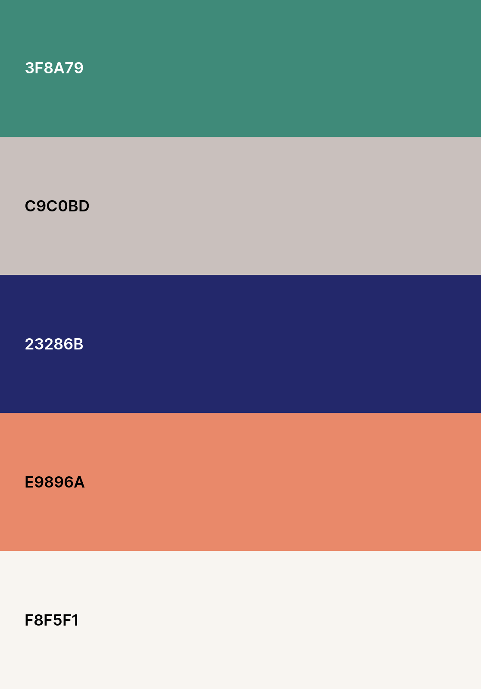

```{r setup, include=FALSE}
library(tidyverse)
library(here)
library(plyr)
library(readr)
library(reshape2)
library(scales)
library(forcats)
library(janitor)
library(gridExtra)
```

```{r, include=FALSE}
#Reading in Data

#Rails to Trails
trails <- read_csv(here::here("data/bicycle_boom_2020.csv"))

#Shifting Streets: Covid-19 mobility reponses around the world
shifting_streets_mobility <- read_csv(here::here("data/shifting_streets_mobility.csv"))

actions <- read_csv(here::here("data/ACTIONS-Grid view.csv"))
actions_new <- actions %>% 
  mutate(`Action type` = str_split(`Action type`, pattern = ",")) %>%
  unnest(`Action type`)
actions_new <- plyr::rename(actions_new, c("Action type" = "Type"))

#pulled data from https://www.npd.com/wps/portal/npd/us/news/press-releases/2020/cycling-industry-sales-growth-accelerates-in-april/
npd <- data.frame (Type  = c("Lifestyle/Leisure", "Mountain", "Children's", "Helmets", "Water Bottle Cages", 
                             "Bike Baskets", "Stationary", "Electric"),
                  Growth = c(203, 150, 107, 49, 60, 85, 270, 92
                  )) 
npd$Type <- as.factor(npd$Type)
write_csv(npd, here::here("data/npd.csv"))
```


```{r, fig.width=8, echo=FALSE, include=FALSE}
trails <- trails[-c(6:22)]
trails <- na.omit(trails)
trails <- plyr::rename(trails, c("Week of" = "Week", "2019 Count" = "2019", 
                                 "2020 Count" = "2020", "Change 2019-2020" = "Change" ))

trails$Week <- as.factor(trails$Week)
trails$Week <- fct_reorder(trails$Week, sort(order(trails$Week)))
levels(trails$Week)

trails_new <- melt(trails)
trails_new$variable <- relevel(trails_new$variable, ref = "2020")
```

# Introduction

As the covid-19 pandemic confined many people to their houses, and limited the use of public transit for commuters, cities across the world saw an uptake in cycling as both a hobby and alternative form of transportation. This report documents my development of a data driven, scrollytelling website which covers the covid-19 “bicycle boom”, using a combination of text and data visualization. My intention was to create a simple and concise, yet visually appealing and informative story about the surge of interest in cycling. This project is targeted towards a very general audience who may be interested in a quick read about the newfound interest in cycling during the pandemic. The language and graphs used in this project were meant to appeal to a wide range of people with varying experiences as cyclists, from individuals who may not cycle at all, to those who have been cycling for years. In terms of graphs, I selected simple and easily recognizable forms of data visualization so readers can clearly understand the information regardless of their level of statistical literacy. Overall, this project was meant to provide a holistic view of the bicycle boom while providing some higher level commentary on the benefits of cycling both in terms of health and as a form of community and personal engagement, as well as discussing the role of infrastructure and city planning to support the safety of new and existing cyclists. The datasets used in this project were processed in R [@citeR], visualizations were created in R, primarily using the `ggplot` package [@ggplot] along with minor visual edits made in Adobe Photoshop, and the final website was created using Webflow. 

# Data

The overall narrative and structure of this project was largely guided and developed around the data I was able to obtain in relation to my topic. While I strived to use primary datasets and sources where available, this was not always possible and I had to make decisions to extract second hand data to visualize in some cases. This section outlines the data used to create the visualizations in my project, the thought process behind the visualizations, and a discussion of potential bias and limitations of the data that was used. 

## Rails to Trails

The first visualization on my webpage is a large area chart comparing trail usage in 2019 and 2020 using data from the non-profit organization, Rails-to-Trails Conservancy (RTC). According to their website, RTC’s goal is to bring more trails to communities, through the creation and linkage of rail-trails, which are public paths created from old railway corridors. The dataset was obtained from the RTC website and contains weekly counts of pedestrians and cyclists from RTC’s 31 trail counters across the United States in 2019 and 2020, along with the percentage change between 2019 and 2020. The final visualization is an area chart depicting differences in trail usage between 2019 and 2020, however I also tested a Cleveland Dot Plots visualization. The two versions of the graph are shown in Figure \@ref(fig:trails)

```{r trails, fig.cap="Rails-to-Trails Conservancy: Trail Usage Graphs (top: area chart, bottom: Cleveland Dot Plots)", fig.post = "H", echo = FALSE, error=F, fig.width=11, fig.height=12}
one <- trails_new %>%
  ggplot(aes(x = Week, y = value, fill = variable, group = variable)) +
  geom_area(alpha=1 , size=.5, colour="white", position = position_dodge(width = 0)) +
  theme(axis.text.x = element_text(angle = 80, size = 12),
        axis.text.y = element_text(size = 10),
        panel.grid.major = element_blank(), panel.grid.minor = element_blank(),
        panel.background = element_rect(fill = "#f8f5f1"),
        plot.background = element_rect(fill = "#f8f5f1"),
        legend.background = element_rect(fill = "#f8f5f1"),
        legend.position = "bottom",
        axis.ticks.x = element_blank(),
        axis.ticks.y = element_blank(),
        axis.title.x = element_text(face = "bold", color = "gray22", size = 13),
        axis.title.y = element_text(face = "bold", color = "gray22", size = 13),
        legend.title = element_text(face = "bold", color = "gray22", size = 13),
        legend.text = element_text(color = "gray22", size = 13)) +
  scale_y_continuous(labels = scales::comma, breaks = scales::pretty_breaks(n = 6)) + 
  scale_fill_manual(values = c("#559e8e", "#e9896a"), labels = c("2020", "2019"), name = "Year") +
  ylab("Pedestrian and Bike Sightings")

two <- trails %>%
  ggplot() +
  geom_segment(aes(x = Week, xend = Week, y=`2019`, yend=`2020`)) +
   geom_point( aes(x=Week, y=`2019`), color=rgb(0.2,0.7,0.1,0.5), size=3 ) +
  geom_point( aes(x=Week, y=`2020`), color=rgb(0.7,0.2,0.1,0.5), size=3 ) +
  theme(axis.text.x = element_text(angle = 80, size = 12),
        axis.text.y = element_text(size = 10),
        panel.grid.major = element_blank(), panel.grid.minor = element_blank(),
        panel.background = element_rect(fill = "#f8f5f1"),
        plot.background = element_rect(fill = "#f8f5f1"),
        legend.background = element_rect(fill = "#f8f5f1"),
        legend.position = "bottom",
        axis.ticks.x = element_blank(),
        axis.ticks.y = element_blank(),
        axis.title.x = element_text(face = "bold", color = "gray22", size = 13),
        axis.title.y = element_text(face = "bold", color = "gray22", size = 13),
        legend.title = element_text(face = "bold", color = "gray22", size = 13),
        legend.text = element_text(color = "gray22", size = 13)) +
  scale_y_continuous(labels = scales::comma, breaks = scales::pretty_breaks(n = 6)) + 
  scale_fill_manual(values = c("#e9896a", "#559e8e"), labels = c("2020", "2019"), name = "Year") +
  ylab("Pedestrian and Bike Sightings")


grid.arrange(one, two)

#ggsave(trailsgraph, file = "trailsgraph.png", width = 12)
```


As both graphs depict, more people were seen walking and cycling on RTC trails across the country in 2020 compared to 2019, with the largest jumps in usage seen in March and April. While the dot plot is more effective at showing the changes in usage between 2019 and 2020, particularly in the spring months, I felt since these types of plots are less common, it was not as intuitive for a general audience to understand compared to the area chart. Overall, while it is less effective at showing the differences between trail usage per week, the area chart is more effective at showing the overall difference between years in an easy to understand and more visually stimulating manner, which is why I selected it as the final visualization. 

However, there are a couple of things to keep in mind when considering this data source. First, since RTC is a non-profit organization whose goal is to promote biking and other activities through trails usage, meaning the organization likely had a non-neutral agenda when promoting this dataset. RTC does not provide much information as to how trail counts were conducted across the different trails, making it difficult to verify the validity of the numbers as there a number of different ways to count trail usage, with some methods being more objective or accurate than others. While RTC published a report outlining trail count methodologies specific to trails in the Bay Area [@bay], the counting methodologies may differ in trails across the countries. Despite this, the general trends shown in the dataset seem to be consistent with overall reports that more people have been cycling this year, particularly the spikes seen in March and April where bicycle sales were particularly high before shortages started affecting retailers.

## NPD Group Sales Data

One of the major talking points about the covid-19 bicycle boom has been the rapid sales growth seen in the cycling industry. Articles from various news sites across the globe have featured interviews and anecdotes from local bike shop owners and other bike retailers discussing their bike sales during the pandemic and subsequent shortages. Unfortunately, I was unable to find any publicly available datasets documenting bicycle sale trends during the pandemic. Since I felt the sales growth for bicycles and accessories was an important part of the overall narrative I wanted to visualize, I decided to pull numbers from industry retail reports put out by The NPD Group, a worldwide market research company. Statistics from the NPD group have consistently shown up in various articles referencing sales growth for the cycling industry. Two main reports were put out by the group, one tracking sales growth in April 2020, which was the first full month the group started focusing on tracking bicycle sales after the industry started growing in March [@npdapril], and another report discussing sales growth in June 2020 [@npdjune]. I chose to use data comparing sales growth for various types of bicycles and accessories between April 2019 and April 2020 since the numbers from March and April best represent the beginning of the bicycle boom. I would have preferred to track bicycle sales and industry growth for different products over time rather than focusing on sales growth in one particular month, however I was unable to find the full set of numbers to do that from the reports provided by the NPD group. This would have also allowed me to talk more about recent supply chain issues in light of the growing demands for bikes. The bar chart used to depict this information is pictured on the following page in Figure \@ref(fig:sales). 

Visualization options were somewhat limited by the exact numbers available in the report, which onlyprovided the percentage sales growth between April 2019 and April 2020 rather than the number of salesof dollar amounts of sales for each category. Although not visually stimulating, I felt a horizontal bar chartwith labelled percentages was the best visualization method given the information available. A caveat ofrelying on second hand data such as this is that there is a lack of transparency surrounding how the data iscollected, processed, and analyzed, making it difficult to validate the numbers in the report and account forpotential bias at various stages of the analysis. Despite not knowing their data practices for these particularreports, the NPD group appears to be a relatively trustworthy source in the realms of market research andbusiness intelligence, making their data an acceptable choice to incorporate into this project given the lackof alternatives.

```{r sales, fig.cap="The NPD Group: Cycling Industry Sales Growth", echo = FALSE, fig.width=10}
npd %>%
  ggplot() + 
  geom_bar(aes(x = reorder(Type, Growth), y = Growth), stat = "identity", fill = "#559e8e") +
  coord_flip() +
    theme(panel.grid.major = element_blank(), 
          panel.grid.minor = element_blank(),
        panel.background = element_rect(fill = "#f8f5f1"),
        plot.background = element_rect(fill = "#f8f5f1"),
        legend.background = element_rect(fill = "#f8f5f1"),
        axis.title.y=element_blank(),
        axis.text.y = element_text(face = "bold", size = 14),
        axis.text.x = element_text(face = "bold"),
                axis.ticks.x = element_blank(),
        axis.ticks.y = element_blank(),
        axis.title.x = element_text(face = "bold", color = "gray22", size = 14)) +
  ylab("Growth (%)") +
  ylim(0, 290) +
  geom_text(aes(label = percent(Growth/100, accuracy = 1L), x = Type, y =Growth), hjust = -0.3, size = 4)

#ggsave(sales, file = "sales.png", width = 12)
```

## Pedestrian & Bicycle Information Center - Shifting Streets

The next visualization utilizes data from the University of North Carolina’s Pedestrian and Bicycle Information Center (PBIC). The Shifting Streets dataset contains a list of actions taken by cities, states, provinces, or countries around the world in response to changing demands for mobility amid social distancing protocols during the pandemic, and is a result of consolidating three other datasets related to mobility during the pandemic [@shifting]. Many of the actions were led by the public sector and focus on steps taken to promote walking, cycling, and other forms of active transportation, and were originally documented in the PBIC dataset titled “Local Actions to Support Walking and Cycling During Social Distancing” [@local]. Data collection, processing, integration, and validation efforts for this dataset were all documented in an accompanying paper published by the authors [@combs2021shifting]. However, since this dataset relies heavily on crowdsourced information and is frequently updated with new information, the authors cannot guarantee the accuracy of all the information it contains despite efforts made to validate the information through sources such as interviews, local experts, and news articles. 

The Shifting Street dataset contains a great deal of information about the various mobility actions taken during the pandemic, such as specific information about the location, action type, function, duration, application, and longevity. Since there are many different actions, and specifics of the various actions may differ, to simplify the visualization and avoid overloading the viewer, I focused on visualizing actions at a higher level of categorization in terms of their function. The function attribute in the dataset acts as a somewhat collapsed version of the action attribute, and categorizes the various actions depending on the manner in which they are intended to help users. Again, for simplicity and readability, I used a flipped barchart to visualize the action functions pictured in Figure \@ref(fig:actionsfinal). I also attached a bar chart depicting the more specific actions to give a sense of the original actions which were condensed in the functions category in Figure \@ref(fig:actionsoriginal). While the dataset contains actions across the globe, I filtered the data to focus only on those reported in the United States or Canada to stay consistent with the other data presented in this project which has largely been based in those countries.  

```{r, include=F, echo=F}
#Shifting Streets Dataset
shifting_streets_mobility$Function <- as.factor(shifting_streets_mobility$Function)

shiftNA <- shifting_streets_mobility %>%
  filter(Country == "United States" | Country == "Canada")

shiftNA <- shiftNA[!is.na(shiftNA$Function), ]
#access to bikes mainly includes bike share, subsidizing bikes, bike parking
#street space for ped/bike includes closing streets to motor vehicles, reallocating lane/curb space, shared street implementation
shiftNA <- mutate(shiftNA, filling = ifelse((Function == "access to bikes" | Function == "other bike/ped supports" | Function == "street space for ped/bike"), "yes","no"))

shiftNA %>%
  filter(Function == "access to bikes" | Function == "other bike/ped supports" | Function == "street space for ped/bike")
```


```{r actionsfinal, fig.cap="Shifting Streets Covid-19 Mobility Data - Functions (Final Version)", echo = FALSE, fig.width=10}
shiftNA %>%
  ggplot() +
  geom_bar(aes(x = fct_rev(fct_infreq(Function)), fill = filling), stat = "count") + coord_flip() +
  scale_x_discrete(labels = c("Influence planning", "Restrict transit mobility", "Boost transit", "Promote cars",
                              "Restrict pedestrian and biking mobility", "Access to bikes (bike share, bike parking, subsidies)", 
                              "Other supports for commerce", "Other supports for pedestrians and biking", "Miscellaneous actions",
                              "Street space for commerce", "Street space for pedestrians and bikes")
                              ) +
  scale_fill_manual(values = c("#c9c0bd", "#559e8e")) + guides(fill = FALSE)  + 
      theme(panel.grid.major = element_blank(), panel.grid.minor = element_blank(),
        panel.background = element_rect(fill = "#f8f5f1"),
        plot.background = element_rect(fill = "#f8f5f1"),
        legend.background = element_rect(fill = "#f8f5f1"),
        axis.title.y=element_blank(),
        axis.title.x=element_text(face = "bold"),
        axis.ticks.x = element_blank(),
        axis.ticks.y = element_blank(),
        axis.text.y = element_text(face = "bold", size = 13, color = "gray22"),
        axis.text.x = element_text(face = "bold", color = "gray22")) +
    ylab("Number of Responses")
#ggsave(actions, file = "actions.png", width = 12)
```


```{r actionsoriginal, fig.cap="Shifting Streets Covid-19 Mobility Data - Actions Version", echo = FALSE, fig.width=10}
shiftNA %>%
  ggplot() +
  geom_bar(aes(x = fct_rev(fct_infreq(Application))), stat = "count") + coord_flip() +
    scale_fill_manual(values = c("#c9c0bd", "#559e8e")) + guides(fill = FALSE)  + 
      theme(panel.grid.major = element_blank(), panel.grid.minor = element_blank(),
        panel.background = element_rect(fill = "#f8f5f1"),
        plot.background = element_rect(fill = "#f8f5f1"),
        legend.background = element_rect(fill = "#f8f5f1"),
        axis.title.x=element_text(face = "bold"),
        axis.title.y=element_text(face = "bold"),
        axis.ticks.x = element_blank(),
        axis.ticks.y = element_blank(),
        axis.text.y = element_text(face = "bold", color = "gray22"),
        axis.text.x = element_text(face = "bold", color = "gray22")) +
    ylab("Number of Responses") +
  xlab("Actions")
```

The top figure depicts the final visualization which was used on the webpage. I used colour to draw attention to the categories of actions which were specifically related to biking, the most common one being the allocation of street space for pedestrians and bikes. The second figure provides more detail on the types of actions taken in different cities, but like I mentioned previously, I found it to be too much information to condense in one graph, and instead chose to elaborate more on the types of actions using text on the webpage. One feature in the dataset I would have liked to visualize is whether or not these actions are temporary or permanent, as this ties in to later discussions about the role of long term investment into biking infrastructure to support cyclists. However, while a significant number of the actions were labelled as temporary, there was a lot of missing data in this section, with many actions having an “unknown” status in regards to their longevity. 

## CAA Bike Safety Statistics

Finally, I included two individual donut style graphics near the end of the webpage to highlight some statistics regarding people’s views on bike safety and infrastructure. The base donut charts were created in R, and embellished with vector icons taken from the flaticon database [@flaticon]. Text describing the statistics was added directly on the webpage, with a screenshot of the final result shown on the top of Figure \@ref(fig:CAAfinal). I also tested a version of the donut chart with labelled percentages in the middle rather than images, which is shown on the bottom of Figure \@ref(fig:CAAfinal), however I felt listing the percentages twice (once on the graphic and once in the text) was redundant, and the verison with the images was more visually appealing.


```{r CAAfinal, fig.cap="CAA Bike Safety Statistics - Final Version", fig.post = "H", echo = FALSE, fig.align = "center", fig.height=7, out.width="75%"}

```

The statistics were pulled from a poll conducted by the Canadian Automobile Association (CAA) in June 2020 which surveyed 2,824 Canadians. Since the full survey data was not made public, the statistics were taken from the CAA official website and related press releases. However, like the sales growth data from the NPD group, an issue with using this type of second hand reported data is that we don’t have a good idea of how that data was collected and processed. In this case, aside from the sample size, I was unable to find much information about the polling methodologies and full range of questions which were asked. Additionally, since the CAA only posted certain statistics on their website rather than a full report of the polling results, there may also be some bias in the way they selectively chose which statistics to focus on. Of course, this also includes bias on my end for also choosing to present those statistics, however it was still important to provide context as to why cycling infrastructure is important from a human perspective regarding safety and how current infrastructure is preventing more people from cycling.

```{r, include=FALSE}
#Single Statistics - CAA
#- 31% of Canadians say they would cycle more if cycling infrastructure was better.
#- 40% of Canadians feel lanes separated by physical barriers would encourage them to cycle more.

#creating data based on these stats for donut chart
data.31 <- data.frame(
  category=c("A", "B"),
  count=c(31, 69)
)

data.31$fraction = data.31$count / sum(data.31$count)
data.31$ymax = cumsum(data.31$fraction)
data.31$ymin = c(0, head(data.31$ymax, n=-1))

thirty <- ggplot(data.31, aes(ymax=ymax, ymin=ymin, xmax=4, xmin=3, fill=category)) +
     geom_rect() +
     coord_polar(theta="y") + 
  theme_void() + 
  xlim(c(1, 4)) +
  theme(legend.position = "none",
        panel.background = element_rect(fill = "#f8f5f1"),
        plot.background = element_rect(fill = "#f8f5f1"),
        legend.background = element_rect(fill = "#f8f5f1")) +
  scale_fill_manual(values = c("#e9896a", "#c9c0bd"))
#ggsave(thirty, file = "thirty.png")

data.40 <- data.frame(
  category=c("A", "B"),
  count=c(40, 60)
)

data.40$fraction = data.40$count / sum(data.40$count)
data.40$ymax = cumsum(data.40$fraction)
data.40$ymin = c(0, head(data.40$ymax, n=-1))

forty <- ggplot(data.40, aes(ymax=ymax, ymin=ymin, xmax=4, xmin=3, fill=category)) +
     geom_rect() +
     coord_polar(theta="y") + 
  theme_void() + 
  xlim(c(1, 4)) +
  theme(legend.position = "none",
        panel.background = element_rect(fill = "#f8f5f1"),
        plot.background = element_rect(fill = "#f8f5f1"),
        legend.background = element_rect(fill = "#f8f5f1")) +
  scale_fill_manual(values = c("#e9896a", "#c9c0bd"))

#ggsave(forty, file = "forty.png")
```

# Formatting and Design Choices

I selected a scrollytelling, or visual narrative format via a web page to share my visualizations and talk more about the covid-19 bike boom. In early brainstorming and development stages, I also considered creating a dashboard, however I felt this might be too limiting given the variety in data sources I utilized and the messaging I wanted to convey through text. When strategizing how to design and write for this project, I kept three main “variables” in mind: the data, the message, and the audience [@amabili2019storytelling]. 

While I had a general idea of the messaging I wanted to convey, which was to provide an overview of the bicycle boom which occurred during the pandemic, I took a data driven approach as to how I structured the narrative of that messaging. I took note of the relevant data that was available to me with rough ideas of how to visualize it, and then tried to form a narrative around that data in a way that felt logical from a reader’s perspective while trying to locate gaps in the narrative that I did not have data for which could be supplemented with text. Using RTC trail usage and sales growth data from the NPD group I first wanted to focus on the “what” of the cycling boom by presenting evidence that the phenomenon exists as shown by increased bike sales and more people seen cycling. I then wanted to discuss why people may be cycling more during the pandemic. Since I wasn’t able to find data to visualize this part, I used brief text blurbs highlighting three potential reasons: transportation alternatives due to transit anxiety, exercise purposes, and the introduction of new programs and initiatives by cities to support cycling during the pandemic. The last point was meant to segway into the Shifting Streets dataset by providing more information showing the different ways in which cities have taken actions which impact cycling. Finally, I wanted to discuss the future of cycling after the pandemic, the benefits of cycling and why I hope the trend will continue, and further steps that should be taken to support and promote cycling. I highlighted concerns about infrastructure as a barrier to cycling in light of the CAA polling data conducted in June 2020, along with the fact that many of the infrastructure related actions reported in the Shifting Streets dataset were only temporary. Based on this narrative structure and with a rough idea of my data visualizations, I sketched a draft shown in Figure \@ref(fig:sketch) of how I planned to organize the graphical and textual elements of the story in a scrollytelling format on Webflow.

```{r sketch, fig.cap="Draft of Scrollytelling Webpage", fig.post = "H", echo = FALSE, fig.hesight=8, fig.height=10, out.width="100%", fig.align="center"}

```

When planning out how to incorporate aesthetic elements and themes, along with how and where to use text elements, I tried to keep the intended audience in mind. I aimed to make a simple, yet visually appealing and informative narrative which relied on brief paragraphs along with the data visualizations to help illustrate my topic. With the limited data available, I felt it was difficult to rely solely on visualizations to effectively communicate the story, which is why I incorporated text throughout the project to either provide more context or information in certain areas, or elaborate on the graphs. When writing paragraphs and text blurbs for this piece, I tried to keep the writing simple and direct, and limited the written sections to three or four sentences maximum, as my intention was not to create something resembling a longer news article or journalism piece. 

I utilized colour to make the website and graphs visually interesting to look at, despite the simplicity of the structure. The colour palette I used is pictured below in Figure \@ref(fig:palette).

```{r palette, fig.cap="Colour Palette", fig.post = "H", echo = FALSE, fig.height=7, out.width="50%", fig.align="center"}

```

Despite the variety in the colour palette, the majority of the graphs and coloured elements in the project were somewhat monochromatic and centralized on the colour green, with the occasional orange and dark blue accent colour. I chose the colour green as a focal point for this project since it is generally viewed as a “positive” colour and is often associated with health and nature, and I wanted to highlight cycling in a positive light as a way to stay active and healthy. For visual accessibility purposes, I tried to use as much contrast as possible between the text and background colours (primarily the dark green and white colours). While I considered the usage of additional illustrated vectors alongside the text elements (such as illustrations of people biking), I ultimately decided to take a more simplistic approach in terms of illustrations to avoid too much visual overload. However, I did utilize some flat vector icons throughout the site, such as in the donut charts and in areas that I felt were heavy with text and could use some added visual elements. Aside from the graphs, the only other major visual component on the website is the cover image at the top, which is an edited photograph of a bicycle in front of a scenic backdrop. Although not outwardly obvious, this photograph was a personal touch as it was taken by my boyfriend during one of his cycling trips in 2020. I am not an avid cycler myself, but I was inspired to explore this topic for this project due to his enthusiasm for cycling and the stories he tells about the cycling community in Toronto. 

# Weaknesses and Limitations

Another source of personal bias was my attempt to portray cycling in a positive light. While it is true that cycling comes with all of the positive benefits I discuss in the project, cycling fatalities remain a prominent issue even during the pandemic. I briefly discussed bike safety in the context of infrastructure, however this project makes no explicit reference to cycling fatalities. There are some reports which suggest cycling fatality rates either rose or stayed the same despite less cars being on the road and the implementation of new bike lanes [@fatal], however there I was unable to find more data on this. During my initial research and development stages, I did not come across any data about cycling fatalities during the pandemic, nor did it occur to me at the time to do more research on that particular aspect of the bicycle boom. After reflecting on the project and subject matter, I realize it may have been a personal bias on my part to not include more information on the dangers of cycling. Given the circumstances of covid-19, I wanted to create a project focusing on what I consider to be a more positive story which came out of the pandemic and highlight the benefits of cycling, however in doing so I may have neglected to acknowledge some of the more dangerous aspects of cycling involving fatalities. 

Regarding the project itself, there are some aspects I would have liked to improve upon or add if I had more time to learn and familiarize myself with the tools necessary to do so. One thing the project could have benefitted from was the ability to interact with some of the graphs. For instance, it would have been interesting to highlight certain weeks on the area chart depicting trail usage and see more specific number counts, or the percentage growth in ridership between 2019 and 2020. The visual narrative might have been more compelling if readers were able to directly engage and interact with the data rather than passively viewing static charts. In some ways, the project was limited by my own technical abilities and comfort levels. Since I had little to no prior experience doing web design or working with html and CSS, I primarily relied on the basic features of Webflow’s digital editor combined with my existing knowledge of R and ggplot to create the graphs. However, I acknowledge the limitations of only working with what I am familiar with, and believe experimenting with other platforms and techniques would have been helpful to the overall design process and finished product. I would be interested in revisiting this project in the future and incorporating more interactive elements if more data on this topic ever gets released. 

\newpage

# References
